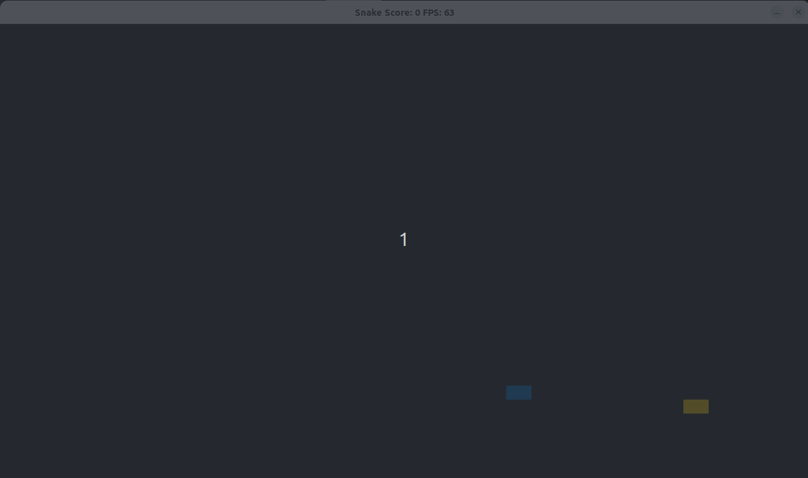

# About the CPP Nanodegree Program Capstone Project: Snake Game Example

The code for this repo was inspired by [this](https://codereview.stackexchange.com/questions/212296/snake-game-in-c-with-sdl) excellent StackOverflow post and set of responses. This is the capstone project you need to develop to get certified in Udacity's C++ Nanodegree program. To obtain this certification, your project must satisfy these conditions:

* The project demonstrates an understanding of C++ functions and control structures.
  * The submission must compile and run.
* Loops, Functions and I/O
  * The project demonstrates an understanding of C++ functions and control structures.
  * The project reads data from a file and process the data, or the program writes data to a file.
  * The project accepts user input and processes the input.
* Object Oriented Programming
  * The project uses Object Oriented Programming techniques.
  * Classes use appropriate access specifiers for class members.
  * Class constructors utilize member initialization lists.
  * Templates generalize functions in the project.
* Memory Management
  * The project makes use of references in function declarations.
  * The project uses destructors appropriately.
  * The project uses move semantics to move data, instead of copying it, where possible.
  * The project uses smart pointers instead of raw pointers.
* Concurrency
  * The project uses multithreading.
  * A promise and future is used in the project.
  * A mutex or lock is used in the project.
 

## Technologies in use in this project
* Mutexes (Lock and unlock threads)
* Cmake and Make
* A-Star Algorithm (Used to create an automatic enemy snake)
* SDL Library (Used to render rectangles in the screen, you can find more [here](https://wiki.libsdl.org/SDL2/APIByCategory))
* Smart pointers
* Files Management
* Futures (to run Multithreading)

## Dependencies for Running Locally
* cmake >= 3.7
  * All OSes: [click here for installation instructions](https://cmake.org/install/)
* make >= 4.1 (Linux, Mac), 3.81 (Windows)
  * Linux: make is installed by default on most Linux distros
  * Mac: [install Xcode command line tools to get make](https://developer.apple.com/xcode/features/)
  * Windows: [Click here for installation instructions](http://gnuwin32.sourceforge.net/packages/make.htm)
* SDL2 >= 2.0
  * All installation instructions can be found [here](https://wiki.libsdl.org/Installation)
  >Note that for Linux, an `apt` or `apt-get` installation is preferred to building from source. 
* gcc/g++ >= 5.4
  * Linux: gcc / g++ is installed by default on most Linux distros
  * Mac: same deal as make - [install Xcode command line tools](https://developer.apple.com/xcode/features/)
  * Windows: recommend using [MinGW](http://www.mingw.org/)

## Basic Build Instructions

1. Clone this repo.
2. Make a build directory in the top level directory: `mkdir build && cd build`
3. Compile: `cmake .. && make`
4. Run it: `./SnakeGame`.

## CC Attribution-ShareAlike 4.0 International

Shield: [![CC BY-SA 4.0][cc-by-sa-shield]][cc-by-sa]

This work is licensed under a
[Creative Commons Attribution-ShareAlike 4.0 International License][cc-by-sa].

[![CC BY-SA 4.0][cc-by-sa-image]][cc-by-sa]

[cc-by-sa]: http://creativecommons.org/licenses/by-sa/4.0/
[cc-by-sa-image]: https://licensebuttons.net/l/by-sa/4.0/88x31.png
[cc-by-sa-shield]: https://img.shields.io/badge/License-CC%20BY--SA%204.0-lightgrey.svg
